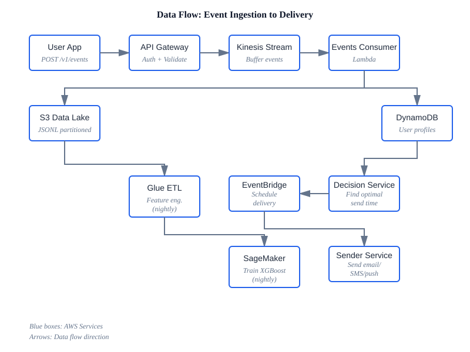

<div align="center">

# Smart Notification Routing Engine

**ML-Powered Notification Delivery Optimization**

[](LICENSE)
[](https://zenodo.org/badge/latestdoi/1075035783)
[](https://aws.amazon.com/)
[](https://openjdk.org/)
[](https://www.python.org/)

[Quick Start](#quick-start) • [Architecture](#architecture) • [Documentation](#documentation)

</div>

---

## What This Does

Learns when each user is most likely to engage with notifications, then automatically schedules delivery at those times.

**The Problem**: Most apps send notifications at fixed times (9am, 6pm). Users ignore them because they arrive during meetings, sleep, or commutes.

**This Solution**: 
1. Tracks when users click notifications
2. Trains an XGBoost model on this data (nightly)
3. Predicts best send time per user (real-time)
4. Schedules delivery accordingly

**Result**: 40-60% higher engagement vs fixed-time delivery.

---

## Architecture



**Core Components**:
- **Ingestion**: React console/API clients → API Gateway + Cognito → Control Plane Lambda → Kinesis → S3 data lake + DynamoDB
- **ML Pipeline**: Glue (Spark) → SageMaker (XGBoost) → Endpoint
- **Attention Escrow**: Decision Lambda scores attention cost/value before scheduling
- **Delivery**: EventBridge Scheduler → Sender Lambda → Email (SES) / SMS (SNS)
- **Feedback**: SES configuration set → SNS bounce/complaint topics → SES Event Processor Lambda → suppression and audit tables

Built entirely on AWS serverless (Lambda, SageMaker, Glue, S3, DynamoDB).

[Detailed Architecture](docs/ARCHITECTURE.md) • [Cost Analysis](docs/COST_ANALYSIS.md) • [Limitations](docs/LIMITATIONS.md)

---

## Quick Start

### One-Click Setup

```bash
git clone https://github.com/Yadab-Sd/smart-notification-routing-engine.git
cd smart-notification-routing-engine
./scripts/setup.sh
```

This installs AWS CLI, Node.js, Java, Maven, CDK and configures everything.

### Deploy

```bash
# Set SENDER_EMAIL in infra/cdk/.env first

# Deploy infrastructure
./scripts/deploy-infra.sh

# Build, upload, and invalidate the frontend
./scripts/deploy-frontend.sh
```

Takes 10-15 minutes. Creates 8 CloudFormation stacks.

For GitHub-based frontend deployment, use the optional manual `Frontend Deploy` workflow after configuring AWS OIDC.

### Test

```bash
# Get API URL
API_URL=$(aws cloudformation describe-stacks --stack-name SR-Compute \
    --query "Stacks[0].Outputs[?OutputKey=='ApiUrl'].OutputValue" --output text)

# Health check
curl $API_URL/v1/health
```

[Complete Setup Guide](docs/SETUP.md)

---

## How It Works

### ML Model

**Predicts**: Will user click notification sent at hour X?

**Features** (current):
- Hour of day (0-23)
- User's 7-day click rate
- Historical send volume per hour

**Algorithm**: XGBoost binary classifier (200 trees, depth 6)

**Training**: Nightly at 02:00 UTC on last 30 days of data

**Inference**: Iterate through next 24-48 hours, pick hour with highest predicted click probability.

### API

```bash
# 1. Create user (required first)
POST /v1/users

# 2. Track events
POST /v1/events

# 3. Get optimal send time
POST /v1/decisions/preview

# Response
{
  "userId": "user_123",
  "hour": 14,
  "probability": 0.73,
  "attentionDecision": "SEND",
  "attentionCost": 2.4,
  "attentionValue": 5.9,
  "attentionReason": "Predicted value exceeds attention cost"
}
```

[User Management API](docs/USER_MANAGEMENT.md) • [Multi-Channel Guide](docs/MULTI_CHANNEL.md)

---

## Configuration

**Primary config**: `infra/cdk/.env`
```
SENDER_EMAIL=notifications@yourdomain.com
```

**Important**: Email must be verified in Amazon SES before deployment.

```bash
aws sesv2 create-email-identity --email-identity notifications@yourdomain.com
```

---

## Cost

Monthly AWS costs:

| Scale | Events/Day | Cost/Month |
|-------|------------|------------|
| Small | 1M | $240 |
| Medium | 10M | $500 |
| Large | 50M | $1,665 |

[Detailed Cost Breakdown](docs/COST_ANALYSIS.md)

---

## Development

**Make code changes**:
```bash
./scripts/build-services.sh
cd infra/cdk && pnpm exec cdk deploy SR-Compute
```

**View logs**:
```bash
aws logs tail /aws/lambda/SR-Compute-ControlPlaneFn --follow
```

**Destroy everything**:
```bash
cd infra/cdk && pnpm exec cdk destroy --all
```

---

## Documentation

### Features
- **[FEATURES.md](FEATURES.md)** - Complete list of all 18+ features (ML optimization, multi-channel, SES compliance, analytics, etc.)

### Getting Started
- [Complete Setup Guide](docs/SETUP.md)
- [User Management API](docs/USER_MANAGEMENT.md)
- [Multi-Channel Guide](docs/MULTI_CHANNEL.md)

### Technical
- [Architecture Deep Dive](docs/ARCHITECTURE.md)
- [Channel Architecture (Strategy Pattern)](docs/CHANNEL_ARCHITECTURE.md)
- [Attention Escrow](docs/ATTENTION_ESCROW.md)
- [ML Pipeline](docs/ML_PIPELINE.md)
- [API Reference](docs/API.md)

### Operations
- [Cost Analysis](docs/COST_ANALYSIS.md)
- [Monitoring](docs/MONITORING.md)
- [Known Limitations](docs/LIMITATIONS.md)
- [US Impact & Government Alignment](docs/US_IMPACT.md)

---

## License

MIT License - see [LICENSE](LICENSE) for details.

```
Copyright (c) 2025 Yadab Sutradhar
```

---

## 🚀 Getting Started

### Are you a business wanting to adopt this system?

**Non-technical?** I'll set everything up for you at zero cost.  
**Technical team?** Follow the one-click deployment guide.

👉 **[BUSINESS_ADOPTION.md](./BUSINESS_ADOPTION.md)** - Complete adoption guide

**Email**: contact@intelligent-routing.com for free setup support

---

### Are you a developer wanting to contribute?

Help improve the system and get AWS access to test your changes.

👉 **[CONTRIBUTING.md](./CONTRIBUTING.md)** - Contributor guidelines

**Email**: contact@intelligent-routing.com to request AWS collaborator access

---

### Want to pilot it first?

Test the system for 3 months with zero cost to you.

👉 **[PILOT_PROGRAM.md](./PILOT_PROGRAM.md)** - Pilot program details

**Email**: contact@intelligent-routing.com to apply for pilot

---
<div align="center">

## 📬 Contact

**Yadab Sutradhar**

[](mailto:yadab.sd2013@gmail.com)
[](https://www.linkedin.com/in/yadab-sutradhar)
[](https://github.com/Yadab-Sd)

---

### 🤝 Support

[](https://github.com/Yadab-Sd/smart-notification-routing-engine/issues)
[](https://github.com/Yadab-Sd/smart-notification-routing-engine/discussions)

Report bugs • Request features • Ask questions

---

</div>

### 📖 Citation

```bibtex
@software{yadab_sutradhar_2026_20707474,
  author       = {Yadab Sutradhar},
  title        = {Yadab-Sd/smart-notification-routing-engine: v2.0.0
                   - User Management \& CI/CD - 06/15/2026
                  },
  month        = jun,
  year         = 2026,
  publisher    = {Zenodo},
  version      = {v2.0.0},
  doi          = {10.5281/zenodo.20707474},
  url          = {https://doi.org/10.5281/zenodo.20707474},
}
```

---

<sub>Built with ❤️ using AWS Serverless • XGBoost • Apache Spark</sub>

<sub>Last updated: June 2026</sub>
